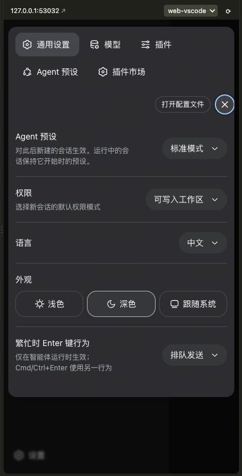
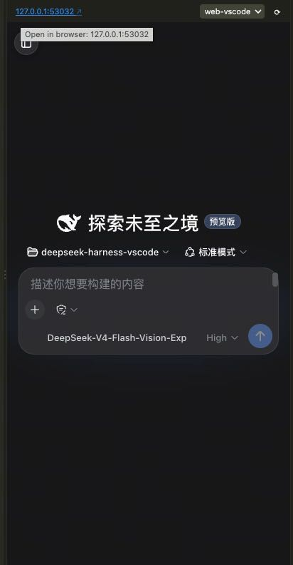

# better-dsh-sidebar

Run **DeepSeek Harness** in VS Code with an **independent profile** and a UI
purpose-built for the sidebar. On activation the extension boots a dedicated profile
(`web-vscode` by default — never your personal `web` profile), waits for the server,
and shows the UI in a **sidebar webview** (activity-bar view container). An "Open in Simple Browser"
command is also available. When the view is narrower than 1024px, the
`dsh-mobile-nav` narrow-screen support makes it adapt like a phone (overlay drawer,
full-width conversation, mobile settings, etc.) — reusing the layout work from the
[`dsh-web-mobile`](https://github.com/mexiaosqwq/dsh-web-mobile) project.

<p align="center">
  
  
</p>

## Why this exists

The DeepSeek Harness browser UI is a normal web app served over HTTP. This extension
is a thin VS Code wrapper around it:

- **Independent instance** — the extension boots a dedicated profile
  (`web-vscode` by default) instead of your personal `web` profile, so the
  embedded UI only loads the harness bundles plus the narrow-screen plugin and
  nothing else (no `dshmarket`, agent teams, hindsight, etc.). On first use the
  extension auto-provisions the profile with `@deepseek-ai/dsh-base` +
  `@deepseek-ai/dsh-web-app` (resolved from the installation fallback) and
  installs the bundled `dsh-mobile-nav` (from `deps/`) into it.
- **Server management** — starts `dsh --profile <name>` on a loopback host, picks
  a free port (or uses a configured one), waits for readiness, and stops the
  process with the panel/extension.
- **Sidebar embedding** — a sidebar WebviewView loads the UI. The view's HTML
  mirrors VS Code's own Simple Browser exactly: CSP `frame-src *`, `enableScripts`
  + `enableForms`, a fixed iframe sandbox
  `allow-scripts allow-forms allow-same-origin allow-downloads`, and the iframe
  `src` assigned by a nonce'd script. That is the proven recipe for loading a
  cross-origin local HTTP app inside a webview. (A hand-rolled iframe with a
  port-scoped CSP and no `enableForms` ends up sandboxed without `allow-scripts`,
  which blocks the dsh JS and renders blank — that's the pitfall this avoids.)
- **Narrow-screen support** — the extension ships a **minimal, trimmed
  `dsh-mobile-nav` core** under `deps/dsh-mobile-nav` and installs it into the
  dedicated profile. It keeps the narrow-screen adaptation: the mobile stylesheet
  (`base` keyframes + `layout` + `misc`), a frame marker on the shell frame, the
  phone-chrome guards (status bar / theme-color / double-tap-zoom), and the
  plain-DOM drawer controls (a header toggle in the active phase, a floating
  button on the hero/blank phase, and a backdrop to close). Everything non-core
  is stripped out of the vendored plugin — React slots, the drawer footer,
  haptics, stats rows, debug badge, third-party compatibility
  (aionui / usage-stats / genui / git-graph / pet), the DOM reconciler, and
  locales. The plugin's `lib/client.js` is a self-contained CommonJS module
  (regenerate with `npm run build:core`).

  How it works: on any viewport < 1024px the stylesheet turns the shell's
  three-column grid into `1fr 0 0` (conversation full width), slides the sidebar
  into an overlay drawer, and adapts the settings sheet, composer, header and
  message flow. A header toggle (or the floating button on the empty state) opens
  the drawer, and the backdrop tap or Escape closes it. At ≥ 1024px every rule
  and control is media-gated off, so desktop is unchanged.

## Sidebar toolbar

The sidebar view has a slim toolbar above the embedded UI:

- **Server address** — shows the running server (`ip:port`). Click it to open
  the UI in your system's default browser.
- **Profile dropdown** — switches the sidebar between dsh profiles on the fly
  (e.g. the dedicated `web-vscode` and your personal `web`). The choice is
  persisted in the `dshharness.profile` setting and switching reboots the
  server. Selecting your personal `web` profile boots it as-is — the extension
  never provisions or modifies it.
- **Restart (⟳)** — stops the dsh server and boots it again, then reloads the
  UI (the port may change when `dshharness.port` is `0`).

## Requirements

- `dsh` CLI (>= 0.1.0-rc.7) on `PATH` (or configure `dshharness.dshBin`).
- `pnpm` on `PATH` — only needed the first time the dedicated profile is
  provisioned (installing the bundled `dsh-mobile-nav`).
- No `dsh-mobile-nav` checkout needed — a copy ships inside the extension
  (`deps/dsh-mobile-nav`).

## Commands

| Command | What it does |
| --- | --- |
| **DeepSeek Harness: Open Panel** | Start the server if needed and reveal the sidebar view. |
| **DeepSeek Harness: Open in Simple Browser** | Start the server if needed and open the UI in VS Code's built-in Simple Browser. |
| **DeepSeek Harness: Install Narrow-Screen Support (dsh-mobile-nav)** | Reinstalls the bundled narrow-screen support into the dedicated profile. |
| **DeepSeek Harness: Install Plugin into Sidebar Profile** | `dsh plugin --profile <name> add <spec>` for any plugin into the sidebar instance. |
| **DeepSeek Harness: Stop Server** | Stop the running `dsh web` process. |

A "DeepSeek Harness" icon appears in the activity bar; click it to open the sidebar view.

## Installing plugins into the sidebar

The sidebar is just the dedicated `web-vscode` dsh profile, so you can install
plugins into it — this never touches your personal `web` profile. Either run the
CLI directly, or use the **Install Plugin into Sidebar Profile** command:

```sh
dsh plugin --profile web-vscode add <package-name | link:/abs/path | github:user/repo>
dsh plugin --profile web-vscode remove <package-name>
```

Then restart the sidebar server (Stop Server, then Open Panel) to apply.
Narrow-screen support is one such plugin in that profile, so installing others is
compatible with it. Git-hosted specs may require a pnpm `allowBuilds` approval for
their prepare build.

## Settings

| Setting | Default | Meaning |
| --- | --- | --- |
| `dshharness.dshBin` | `dsh` | Path or command name of the dsh CLI. |
| `dshharness.profile` | `web-vscode` | The dsh profile to boot (and provision, unless it is your personal `web`). Switch it from the sidebar toolbar. |
| `dshharness.host` | `127.0.0.1` | Loopback host the server binds to. |
| `dshharness.port` | `0` | Server port; `0` picks a free port, a positive value is used verbatim. |
| `dshharness.mobileNavPath` | *(empty)* | Optional absolute path to your own `dsh-mobile-nav` checkout. Leave empty to use the copy bundled with this extension. |
| `dshharness.openOnStart` | `true` | Reopen a previously-open panel on VS Code start. |

> Narrow-screen support is on by default: the extension **ships a copy of
> `dsh-mobile-nav`** under `deps/` and installs it into the dedicated profile
> automatically (extension-relative path, so it works on any machine after the
> extension is published/installed). Set `dshharness.mobileNavPath` only to point
> at your own checkout during development.

## Development

```sh
npm install
npm run compile   # tsc -> out/
```

Run with the Extension Development Host (F5) after `npm run compile`.

## Packaging

```sh
npm run package   # produces better-dsh-sidebar-*.vsix via vsce
```

## License

[MIT](LICENSE)
